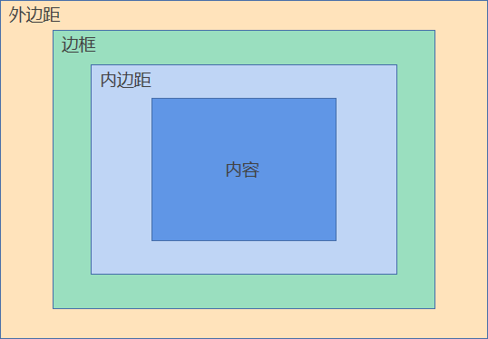

## 盒模型剖析图

CSS 会把元素渲染成各种各样的盒子，再进行排版，这些盒子的模型图如下：



基于这个盒模型剖析图，我们可以通过使用 `margin`、`border`、`padding`、`height` 和 `width` 来设置盒子的外边距，边框，内边距和宽高，使用调试工具可以看到这些这些区域的会被高亮。

在 CSS 中，我们可以用选择器选中盒子进行样式的设置，但是也有一部分盒子不能选中，那部分盒子被称作 **匿名盒子**，比如：

```html
<style>
  div,
  p {
    border: 1px solid black;
  }
</style>

<div>
  匿名盒子
  <p>p 元素的盒子</p>
  你无法选中这行文本产生的匿名盒子
</div>
```

在上述代码中，我们可以选中 `div` 和 `p` 元素产生的盒子，但是不能选中 `匿名盒子` 和 `你无法选中这行文本产生的匿名盒子` 这两行文本产生的盒子，它们被称作匿名盒子。

## 盒模型属性

### 内容区大小

盒模型内容区的大小使用 `width` 和 `height` 及其最大最小值属性设置：

| 属性         | 描述                              |
| ------------ | --------------------------------- |
| `width`      | 设置内容区的宽度，默认值 `auto`。 |
| `height`     | 设置内容区的高度，默认值 `auto`。 |
| `max-width`  | 设置内容区的最大宽度              |
| `min-width`  | 设置内容区的最小宽度              |
| `max-height` | 设置内容区的最大高度              |
| `min-height` | 设置内容区的最小高度              |

比如：

```html
<style>
  .foo {
    width: 100px;
    height: 100px;
    background-color: black;
  }
</style>
<div class="foo"></div>
```

最大最小值一般用于限制拉伸时过大或过小产生的变形，比如：

```css
body {
  min-width: 1200px;
}
```

上面代码会限制页面的最小宽度为 `1024px`，那么当我们缩小浏览器窗口的时候，页面宽度被压缩到 1200px 就不会再缩小。

### 内边距

盒模型的内边距大小使用 `padding` 相关属性设置：

| 属性             | 描述                                                                                                                                                                        |
| ---------------- | --------------------------------------------------------------------------------------------------------------------------------------------------------------------------- |
| `padding-left`   | 设置左侧内边距                                                                                                                                                              |
| `padding-right`  | 设置右侧内边距                                                                                                                                                              |
| `padding-top`    | 设置顶部内边距                                                                                                                                                              |
| `padding-bottom` | 设置底部内边距                                                                                                                                                              |
| `padding`        | 内边距简写，当值为：<br/>1 个值：设置全部内边距；<br />2 个值：设置垂直和水平内边距；<br />3 个值：设置顶部、水平、底部内边距；<br />4 个值：顺时针依次从内上边距开始设置。 |

例如：

```html
<style>
  .foo {
    padding-top: 10px;
    padding-left: 20px;
  }
</style>
<div class="foo">content</div>
```

上面的 `div` 元素顶部和左侧内边距分别被设置成了 `10px` 和 `20px`。

使用 `padding` 简写更加方便，比如：

```html
<style>
  .one {
    padding: 10px;
  }
  .tow {
    padding: 10px 20px;
  }
  .three {
    padding: 10px 20px 30px;
  }
  .four {
    padding: 10px 20px 30px 40px;
  }
</style>
<div class="one">内边距全为 10px</div>
<div class="tow">上下内边距 10px，左右内边距 20px</div>
<div class="three">顶部内边距 10px，左右内边距 20px，底部内边距 30px</div>
<div class="four">内边距：上 10px，右 20px，下 30px，左 40px。顺时针设置</div>
```

### 边框

盒模型的边框一般使用 `border` 相关属性设置：

| 属性                 | 描述                                                                                                                                                        |
| -------------------- | ----------------------------------------------------------------------------------------------------------------------------------------------------------- |
| `border-width`       | 设置边框宽度                                                                                                                                                |
| `botder-style`       | 设置边框样式：<br/>`none`：无边框；<br/> `solid`：实线；<br/>`dashed`：虚线；<br/>[其他样式](https://developer.mozilla.org/zh-CN/docs/Web/CSS/border-style) |
| `border-color`       | 设置边框颜色                                                                                                                                                |
| `border`             | 边框样式简写，比如：`border:1px solid silver`                                                                                                               |
| 单独设置四边框       | 可以使用 `border-left-width` 这些属性单独针对某一条边框设置样式，如：<br/>`border-left-color` 设置左边框颜色；<br/>`border-left` 简写左边框样式。           |
| `border-radius`      | 设置圆角，CSS3 属性，IE9 及以上兼容。                                                                                                                       |
| 单独设置四边框的圆角 | 可以使用 `border-top-left-radius`、`border-top-right-radius`、`border-bottom-left-radius`、`border-bottom-left-radius` 单独设置四个角的圆角                 |

> 这里只是对圆角进行简要介绍，你可以 [点击这里](https://developer.mozilla.org/zh-cn/docs/web/css/border-radius) 查看圆角的详细设置。

### 外边距

盒模型的外边距使用 `margin` 相关属性设置，和 `padding` 相关属性使用方式相同：

| 属性            | 描述                                                                                                                                                                        |
| --------------- | --------------------------------------------------------------------------------------------------------------------------------------------------------------------------- |
| `margin-left`   | 设置左侧外边距                                                                                                                                                              |
| `margin-right`  | 设置右侧外边距                                                                                                                                                              |
| `margin-top`    | 设置顶部外边距                                                                                                                                                              |
| `margin-bottom` | 设置底部外边距                                                                                                                                                              |
| `margin`        | 外边距简写，当值为：<br/>1 个值：设置全部外边距；<br />2 个值：设置垂直和水平外边距；<br />3 个值：设置顶部、水平、底部外边距；<br />4 个值：顺时针依次从外上边距开始设置。 |

外边距决定了盒模型的最边缘，布局时，会从外边距部分开始，比如：

```html
<style>
  .foo {
    margin-left: 100px;
    background-color: silver;
  }
</style>

<div class="foo">content</div>
```

外边距有时会设置负值，它会朝着反方向拉伸，比如：

```html
<style>
  .foo {
    margin-left: -100px;
    background-color: silver;
  }
</style>

<div class="foo">这段的文字的一部分会被抵消到屏幕外</div>
```

## 溢出

如果盒模型中的内容过多，并且又限制了内容区大小，就会发生溢出现象。

可以使用 `overflow` 相关属性来设置溢出样式：

| 溢出属性     | 描述                                                                                                                 |
| ------------ | -------------------------------------------------------------------------------------------------------------------- |
| `overflow-x` | 设置水平溢出样式                                                                                                     |
| `overflow-y` | 设置垂直溢出样式                                                                                                     |
| `overflow`   | 对上面两个属性进行简写：<br />一个值：同时设置水平和垂直溢出样式；<br />两个值：第一个值对应 x 轴，第二个值对应 y 轴 |

溢出属性都可以设置以下值：

| 属性值    | 描述                                             |
| --------- | ------------------------------------------------ |
| `visible` | 溢出可见，大部分元素的默认值。                   |
| `auto`    | 溢出时产生滚动条，不溢出正常显示                 |
| `hidden`  | 隐藏溢出内容。                                   |
| `scroll`  | 不论元素是否溢出，直接显示滚动条，此项使用很少。 |

【演示溢出样式】

## 盒模型计算方式

可以设置 `box-sizing` 属性来改变盒模型的计算方式，它有两个可选值：

- `content-box` 标准盒模型，`width` 和 `height` 表示内容宽高
- `border-box` 怪异盒模型，`width` 和 `height` 表示 `border` + `padding` + 内容

例如：

```html
<style>
  .content,
  .border {
    border: 10px solid black;
    width: 100px;
    height: 100px;
    padding: 20px;
  }
  .content {
    box-sizing: content-box;
  }
  .border {
    box-sizing: border-box;
  }
</style>

<div class="content"></div>
<div class="border"></div>
```

上面代码中，`.border` 盒子的大小只有 100 \* 100，边框和内边距都包含在内，而 `.content` 盒子的大小就是 130 \* 130，`width` 和 `height` 只是限制了内容区的大小。

## 盒模型分类

CSS 中有很多种的盒子，它们都是在标准盒模型的基础上进行一些修改。可以使用 `display` 属性来设置了元素渲染时使用的盒子。

根据盒子的大致风格，CSS 把元素分为以下几类：

- 块级元素：**盒子表现为独占一行，相邻块级元素会从上到下排列。**

- 行内级元素：**盒子表现为不会独占一行，相邻行内级元素会从左到右排列。**

  - 行内块元素：**超出一行时不会截断，直接整块换行。**
  - 行内元素：**超出一行时会截断，换行继续展示剩余部分。**

- 表格内部元素：盒子会逐行逐列排列，形成网格结构。

无论分为哪一类，他们的盒子都是在标准的盒模型上进行少量的修改。

> 备注: CSS 中的块级元素是基于 `display` 属性判断的，HTML 的块级元素根据元素名字判断，它们两者有一定的关联，但是不完全等同。

### 块级元素

块级元素的盒子表现为 **独占一行**，对应了默认情况下 HTML 中块级元素的盒子。

**块级元素的盒子会从上到下依次排列，每个块级元素都会占据一整行，如果宽度不满足一行，则会使用外边距自动填充。**

当 `display` 属性为以下值时，元素表现为块级元素：

- `block`：大部分 HTML 块级元素的默认盒子。（比如：`p、div、h1、h2、ul` 等等）
- `table`：`table` 元素的默认盒子，它的内部是按照表格布局排列。
- `list-item`：`li` 元素的默认盒子，`list-item` 盒子的前面会有列表符号。

**css 块级元素的盒子可以设置盒模型的任意值**，并且它们都是 **独占一行**。

【演示 `block`】
【演示 `table` 与 `block` 的区别】
【演示 `list-item` 的列表符号】

### 行内级元素

特点：行内级元素的盒子表现为 **不会独占一行**，对应了默认情况下 HTML 中内联元素的盒子。

**默认情况下，行内级元素会从左到右排列，超过一行的部分会换行显示。如果浏览器的窗口足够宽，相邻行内级元素会全部排列到一行中。**

#### 行内块元素

行内块元素类似于块级元素，不同的是行内块元素不会独占一行，行内块元素有两种盒子：

- `inline-block`：表现为一个行内的块状盒子。（比如，输入框、按钮等等）
- `inline-table`：表现为一个行内表格。

#### 行内元素

行内元素对应了我们所学的一些文本元素，或者匿名文本盒子，行内元素盒模型有一些限制，比如不能设置 `width` 或者 `height`，我会在本节的最后介绍这些限制。

行内元素的盒子只有一个：

- `inline`：大部分内联元素的默认盒子。

### 表格元素

表格内元素的盒模型非常特殊，在 HTML 中介绍过，表格内的元素既不是块级元素，也不是内联元素。表格内每种元素几乎都有特定的盒模型。各个元素默认对应的 `display` 值如下：

| 元素       | 默认 `diplay` 值     |
| ---------- | -------------------- |
| `caption`  | `table-caption`      |
| `th`，`td` | `table-cell`         |
| `tr`       | `table-row`          |
| `tbody`    | `table-row-group`    |
| `thead`    | `table-header-group` |
| `tfoot`    | `table-footer-group` |
| `col`      | `table-column`       |
| `colgroup` | `table-column-group` |

表内的盒模型有以下特点：

- `table-caption` 盒子无限制（满足标准盒模型），其他盒模型都没有 `margin`。
- `table-cell` 盒子没有 `margin`，并且不会产生溢出，单元格的内容会无限扩张单元格大小。
- 剩余盒子大部分只有 `border` 和宽高，并且设置了也无效。

_表格内部元素的盒子虽然多，但是只需要记住 `table-cell` 盒子即可，其他只是补充。_

### 隐藏

当设置 `display` 属性的值为 `none` 的时候，元素就会被隐藏，比如：

```html
<style>
  .foo {
    display: none;
  }
</style>
<div class="foo">这里被隐藏了</div>
```

### 盒模型分类小结

- `display` 属性的值非常多，但是不用全部记忆，最常用的盒模型是以下三个：

  - `block`：块级元素代表
  - `inline-block`：行内块元素代表
  - `inline`：行内元素代表

- 表格内的各种盒子仅做了解，不用完全记忆。

## 文档流

文档流是一个抽象的概念，它表示了元素在页面中的排列方式。默认情况下的文档流又被称作常规流或正常流。

在常规流中：

- 行内级元素会横向排列（默认自左到右），这种横向排列的布局环境和规则被称作 **行内格式化上下文(Inline formatting contexts)简称 IFC** ；

- 常规流中的块级元素会纵向排列（自上而下），这种纵向排列的布局环境和规则被称作 **块格式化上下文(Block formatting contexts)简称 BFC**。

IFC 和 BFC 描述了纵向和横向布局的区域和规则，默认情况下，一个 HTML 文件只有一个 BFC 环境，就是 `<html>` 元素内，这个 BFC 使得整个页面是纵向布局的，然而 IFC 就比较多，可以假想页面足够宽使得页面没有换行，此时每一行都是一个 IFC，IFC 对应了所有的横向排列。

> 备注：表格内有特殊的排列规则和区域，所以表格内部的布局既不是 BFC 也不是 IFC。

### BFC 概述

默认情况下，页面中只有 `html` 元素会产生了一个 BFC，同一个 BFC 内的块级元素有以下规则：

- 块级元素产生的各个盒子依次向下排列，每个盒子 **独占一行**，（嵌套不会产生新的 BFC）
- 如果两个块级元素之间的盒子在垂直外边距上没有阻隔，那么相邻的垂直外边距会出现 **重叠**；（不论两个元素是并列、嵌套甚至是间隔）
- **BFC 内包含创建它的元素内部的所有内容**；

【逐项演示】

### IFC 概述

**所有的行内级元素以及每个单词或汉字都会参与到一个 IFC 中**，IFC 内的盒子（包括匿名盒子）会按照一下方式排列：

- 盒子都会依次按照书写方式排列（默认从左到右）。
- 当盒子相互排列溢出一行的时候 IFC 会产生 **截断**，剩余部分会向下新开一行继续排列。
- 每行都包含了本行中所有的内容，行与行之间没有垂直间距。
- `<br />` 元素的全称实际是 `break`，意思为截断。使用 `br` 元素会主动产生一个 IFC 中的断点，从而实现换行。（_断点_ 并非专业术语，此处只是为了更容易的解释）

> 备注：每行不一定都一样高，某一行可能有一张图片，就会把这行撑得比其他行高。

行内元素的盒子会有些许不同：

- 行内元素的盒子设置 `width`、`height` 无效，盒子的宽高是由行内元素内部的内容撑起；
- `margin`、`border`、`padding` 只在水平方向上正常生效；
- 垂直方向上：`margin` 不显示，`border` 和 `padding` 虽然显示但是不参与布局（垂直方向上的边框和内边距不会撑起行高）；
- 行内元素的盒子会在换行的时候出现截断现象；

行内块元素没有上述限制，可以设置盒模型的任意值，并且在换行的时候，不会截断，而是表现为整块换行。

【逐项演示】
