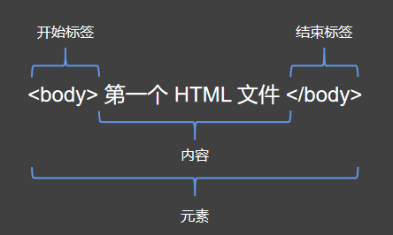

## 元素 - HTML 的基本组成单位

HTML 由 **元素（elements）** 组成，比如上一节通过浏览器打开后，我们可以在控制台上看到以下内容：

```html
<html>
  <head></head>
  <body>
    第一个 HTML 文件
  </body>
</html>
```

在上面的代码中，使用尖括号包裹代码称作 **标签**，比如：`<html>`、`<head>`、`</head>` 等。一个普通的元素由两个标签和标签中间的内容组成，观看下面的的元素剖析图：



上图是一个 `body` **元素**，它由一个 **开始标签**、一个 **结束标签** 以及两个标签包含的 **内容** 组成。

- **开始标签**：开始标签使用尖括号包裹，尖括号内是元素名，表示一个元素的开始。
- **结束标签**：结束标签又称尾标签，和开始标签类似，结束标签的元素名前多了一个反斜杠。
- **内容**：开始标签和尾标签包裹的部分叫做元素的内容，内容不局限于文本信息，也可以嵌套其他元素。
- **元素**：开始标签、结束标签和内容共同组成一个元素。

元素的内容是其标签包裹的部分，所以上面的代码中，整段代码都是一个 `html` 元素。

## 空元素

有一类元素比较特殊，它们并没有内容部分，它们并不需要结束标签，它们被称作 **空元素**。空元素写法如下：

```html
<hr />
<input />
```

空元素 **只有一个标签**，空元素的标签末尾由反斜杠和右尖括号声明。空元素的反斜杠可以被省略，但是有一些老旧的浏览器可能会无法识别，所以编写的时候建议加上反斜杠。

## 元素类别

HTML 把元素分为两大类，**块级元素** 和 **内联元素**，（部分元素不属于这两类，比如后续介绍的一些表格元素）。

**块级元素**：块级元素常常被用来划分网页的结构，比如标题，导航栏，段落，页脚等。默认情况下，它们都独占一行，独立于上一行和下一行的内容，块级元素可以嵌套到其他块级元素中，很少嵌套在内联元素中。

**内联元素**：又名 **行内元素**。内联元素不会独占一行，一般是描述内容更少，比如强调元素 `strong`。

例子：

```html
<strong>强调元素 内联</strong>
<strong>强调元素 内联</strong>
<strong>强调元素 内联</strong>

<p>段落元素 块级</p>
<p>段落元素 块级</p>
<p>段落元素 块级</p>
```

在浏览器中运行上述代码，会发现块级元素都会独占一行，而内联元素都被挤到了一行。

## 元素属性

可以通过给元素添加属性，来对元素进行更加详细的描述，比如生成一个超链接：

```html
<a href="https://weibo.com" title="微博是用来发布信息的平台">微博</a>
```

上面是一个 `a` 元素，用来跳转网页，跳转的地址由 `href` 属性设置，`title` 属性用来设置鼠标移动到链接上时的提示信息。

**属性**：第一个属性前至少需要有一个空格，不能顶头直接写属性名称，属性的名字和值使用等号连接，中间不能有间隙，**属性值可以使用单引号，双引号包裹，也可以不使用引号。**

## 布尔属性

有的属性并不需要设置值，它们称作布尔属性。比如输入框元素的 `disabled` 属性，可以使用 `disabled` 属性来标记输入框是否被禁用。例：

```html
<input /> <input disabled />
```

当添加 `disabled` 属性后，输入框就不能再输入文本。

布尔属性也可以设置值，无论什么值，布尔属性都会被启用：

```html
<input /> <input disabled="disabled" />
```

注意，这和之前的代码是等效的，一般情况下，没有必要给布尔属性设置值。

## 注释

某些时候，代码需要注释一些额外的信息，HTML 有专门编写注释的代码，**注释内的文本不会被浏览器解析，在渲染的时候相当于不存在。**

注释的代码如下：

```html
<!-- 这里是注释内容 -->
```

在大部分编辑器中，可以使用【Ctrl + \/】快捷键来生成注释。

注释内可以换行：

```html
<!-- 
  123
  456
  789
 -->
```

所有的注释都会在程序执行时被忽略。

## 补充

留白：HTML 文件对留白并不敏感，多余的留白并不会影响浏览器对代码的解析，连续的留白会被解析成一个空格。【演示】

关于元素名大小写：**HTML 文件本身是对大小写不敏感的，但是从可读性上来说，建议使用小写。**

## 小结

- HTML 由一个个元素组成
- 元素由开始标签，结束标签及其内容组成，空元素仅由一个标签组成
- 元素被分为两类

  - 块级元素：独占一行，用来划分页面区域。
  - 内联元素：在行内，又称行内元素，用来标记文本、图片等更细致的内容。

- 元素具有属性，普通元素属性由属性名和属性值组成，布尔属性可以不设置属性值。

HTML 的理论知识就那么简单，已经全部学完了，接下来我们开始一个一个的学习元素以及它们的属性。
