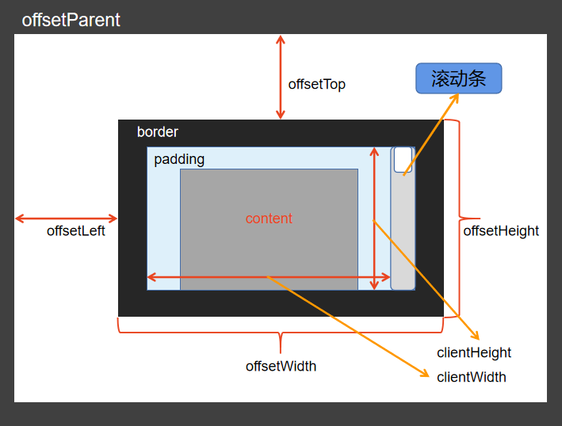
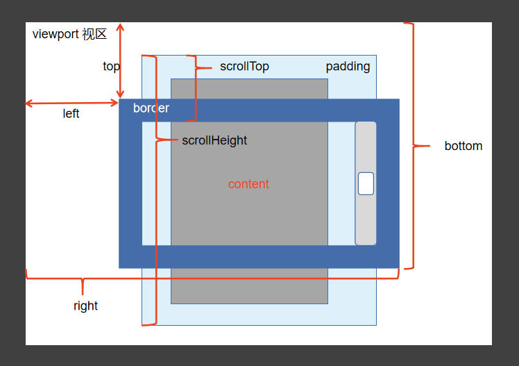

## 概述

DOM（Document Object Model）是文档对象，它记录当前文档中所有 HTML 元素，同时提供了大量访问 HTML 元素的 API。

在 JS 中，DOM 是一个对象，你可以在使用 `document` 来访问它。

尝试修改下 `body` 元素的背景颜色：

```js
document.body.style.background = "black";
```

还可以很鬼畜的玩：

```js
setInterval(function () {
  document.body.style.background = "#" + Math.random().toString().slice(2, 8);
}, 200);
```

## DOM 树与节点

DOM 是链式结构，呈现为树状，所以 DOM 又常常被被称作 DOM 树。

一个简单的页面如下：

```html
<!DOCTYPE html>
<html>
  <head>
    <meta charset="UTF-8" />
    <title>Document</title>
  </head>
  <body>
    <h1 id="h1Name">content</h1>
    text
  </body>
</html>
```

它的树形结构类似下面样子：


DOM 树由一个个的节点组成，有元素节点，有属性节点，有文本节点。 `<!DOCTYPE html>` 是文档声明，不参与 DOM 构建。

我们把上面一个个的框称作节点，他们都继承自 `Node` 类型，`Node` 类型三个基本属性：

- `nodeType`：记录了节点的类型
- `nodeName`：记录了节点的名称
- `nodeValue`：记录了节点的值

DOM 树的 **根节点** 可以使用 `document.documentElement` 来访问，一般它都指向 `html` 元素，另外，`head` 和 `body` 元素可以使用 `document.head` 和 `document.body` 来访问，同时 `document` 也是一个节点，它表示文档节点。

```js
console.log(document); // 整个 DOM 文档
console.log(document.documentElement); // html 元素
console.log(document.head); // head 元素
console.log(document.body); // body 元素
```

## 节点

### 选择节点

DOM 提供多种获取元素的方式：

- `document.getElementById`：获取指定 ID 的元素。
- `document.getElementsByClassName`：获取拥有指定 class 属性的 <mark>元素集合</mark> 。
- `document.getElementsByTagName`：获取指定元素的 <mark>元素集合</mark>。
- `document.getElementsByName`：获取指定 `name` 属性的 <mark>节点列表</mark>。
- `document.querySelector`：获取指定选择器的的第一个节点。
- `document.querySelectorAll`：获取指定选择器的 <mark>节点列表</mark>。

示例：

```js
// 获取 id 为 "bar" 的元素
var foo1 = document.getElementById("bar");

// 获取 class 属性中含有 "bar-class-name" 的所有元素，返回值是一个元素集合，数据结构是一个数组
var foo2 = document.getElementsByClassName("bar-class-name");

// 获取所有 p 元素，返回值是一个元素集合
var foo3 = document.getElementsByTagName("p");

// 获取所有 p 元素，返回值是一个节点列表，数据结构是一个数组
var foo4 = document.getElementsByName("username");

// 获取指定选择器的第一个元素
var foo5 = document.querySelector(".foo a");

// 获取指定选择器的所有元素，返回值是一个节点列表。
var foo6 = document.querySelectorAll(".foo a");
```

### 元素集合与节点列表

元素集合与节点列表不同，观察以下代码：

```html
<p class="foo">foo 1</p>
<p class="foo">foo 2</p>
<p class="foo">foo 3</p>
<p class="foo">foo 4</p>
<p class="foo">foo 5</p>
<script>
  var pEls = document.getElementsByTagName("p");
  var fooEls = document.querySelectorAll("body p.foo");
  function print() {
    console.log("pEls：", pEls);
    console.log("fooEls：", fooEls);
  }
  print();
</script>
```

上面代码会答应两个数组，里面都装着 5 个 p 元素。把控制台切换到 Elements 模块，然后用鼠标选择某个 p 元素摁下【删除键】（backspace or delete）。

删除几个 p 元素后在控制台执行 `print` 函数，你会发现两个数组的数据不一样了，**元素集合会和 DOM 树绑定，如果 DOM 树中的元素被删除，会连带把元素移除对应的元素集合，增加元素同理。但是节点列表不会，它会一直保留选中的元素。**

### 查询节点

每个元素都有以下属性来选择相邻的元素：

按照元素查询：

- `parentElement`：指向父元素
- `nextElementSibling`：指向下一个兄弟元素
- `previousElementSibling`：指向上一个兄弟元素
- `children`：指向子元素数组，是一个元素集合

按照节点查询：

- `parentNode`：指向父节点
- `nextSibling`：指向下一个兄弟节点
- `previousSibling`：指向上一个兄弟节点
- `childNodes`：指向子节点数组，是一个节点列表

示例：

```html
<div id="foo">
  1 号节点
  <span id="bar">2 号节点</span>
  3 号节点
  <em id="baz">4 号节点</em>
  5 号节点
</div>
<script>
  var foo = document.getElementById("foo");
  var bar = document.getElementById("bar");

  var n1 = foo.children; // 返回一个元素集合，里面有 #bar 和 #baz 元素
  var n2 = foo.childNodes; // 返回一个节点列表，里面包含了所有节点

  var n3 = bar.parentElement; // #foo 元素
  var n4 = bar.parentNode; // #foo 节点，它等价于 #foo 元素

  var n5 = bar.nextElementSibling; // #baz 元素
  var n6 = bar.nextSibling; // 3 号节点

  var n7 = bar.previousElementSibling; // null 空值
  var n8 = bar.previousSibling; // 1 号节点
</script>
```

### 创建节点

可以通过以下方式创建节点：

- `document.createElement`：创建元素节点
- `document.createTextNode`：创建文本节点
- `document.createDocumentFragment`：创建空白片段，用来处理多个兄弟级的元素，比如多个 `li` 元素
- `document.createAttribute`：创建属性节点
- `document.createComment`：创建注释节点

示例：

```js
// 创建一个 div 元素
var divEl = document.createElement("div");

// 创建一个文本节点
var textNode = document.createTextNode("文本内容");

// 创建空白片段
var fragment = document.createDocumentFragment();

// 创建一个 src 属性节点
var attrNode = document.createAttribute("src");

// 创建注释节点
var commentNode = document.createComment("这是一段注释");
```

### 添加节点

添加节点常用以下两种方法：

- `Node.appendChild`
- `Node.insertBefore`

`Node.appendChild` 语法如下：

```js
parentNode.appendChild(newChild);
```

其中，`newChild` 会被插入到 `parentNode` 子节点列表的末尾。

示例：

```html
<div id="foo"></div>
<script>
  var foo = document.getElementById("foo");
  for (var i = 10; i > 0; i--) {
    var pEl = document.createElement("p");

    // innerText 属性用来设置元素的内容
    pEl.innerText = "i = " + i;

    // 把 pEl 放到 foo 的末尾
    foo.appendChild(pEl);
  }
</script>
```

`Node.insertBefore` 语法如下：

```js
parentNode.insertBefore(newNode, referenceNode);
```

其中，`newChild` 节点会插入到 `referenceNode` 节点的前面，`parentNode` 是前两者的父节点。

示例：

```html
<ul id="foo">
  <li>第一个</li>
  <li id="bar">第二个</li>
  <li>第三个</li>
</ul>
<script>
  var foo = document.getElementById("foo");
  var bar = document.getElementById("bar");

  var liEl = document.createElement("li");

  // innerText 属性用来设置元素的内容
  liEl.innerText = "一段文本";

  // liEl 元素会被插入到 bar 元素的前面
  foo.insertBefore(liEl, bar);
</script>
```

### 删除节点

可以使用以下两个方法删除节点：

- `Node.removeChild`
- `Node.remove`

`Node.reomveChild` 语法如下：

```js
var child = parentNode.removeChild(oldChild);
```

其中，`parentNode` 是父节点，`oldChild` 是 `parentNode` 的一个子节点。`oldChlid` 会从 `parentNode` 中移除。返回值 `chlid` 全等于 `oldChild`。

示例：

```html
<div id="foo">
  <span id="bar">bar node</span>
</div>
<script>
  var foo = document.getElementById("foo");
  var bar = document.getElementById("bar");

  // bar 从 foo 中移除
  foo.removeChild(bar);
</script>
```

`Node.remove` 语法如下：

```js
oldNode.remove();
```

其中，`oldNode` 元素会从 DOM 中移除。

示例：

```html
<ul>
  <li>第一个</li>
  <li id="bar">第二个</li>
  <li>第三个</li>
</ul>
<script>
  var bar = document.getElementById("bar");

  // bar 元素将从 DOM 中移除
  bar.remove();
</script>
```

**备注：`removeChild` 和 `remove` 都是把元素从 DOM 中移除，并不是直接删除这个元素。**

### 替换节点

可以使用 `Node.replaceChild` 来替换 DOM 中的元素，它的语法如下：

```js
parentNode.replaceChild(newChild, oldChild);
```

其中，`parentNode` 是父节点，`newChild` 会替换 `oldChild` 节点。

示例：

```html
<div id="foo">
  <div id="bar">bar node</div>
</div>
<script>
  var foo = document.getElementById("foo");
  var bar = document.getElementById("bar");
  var baz = document.createElement("baz");
  baz.innerText = "bazzzzzzzzzzzzzzzzzz node";

  // bar 元素将被替换为 baz 元素
  foo.replaceChild(baz, bar);
</script>
```

### 其他节点修改方式

节点处理的方法还有很多，以下方式可能是使用较少或者只有现代浏览器兼容，不再详细介绍，你可以点击下方的链接了解它们：

- [insertAdjacentElement](https://developer.mozilla.org/zh-CN/docs/Web/API/Element/insertAdjacentElement)
- [insertAdjacentHTML](https://developer.mozilla.org/zh-CN/docs/Web/API/Element/insertAdjacentHTML)
- [insertAdjacentText](https://developer.mozilla.org/zh-CN/docs/Web/API/Element/insertAdjacentText)
- [append](https://developer.mozilla.org/zh-CN/docs/Web/API/ParentNode/append)
- [after](https://developer.mozilla.org/zh-CN/docs/Web/API/ChildNode/after)
- [prepend](https://developer.mozilla.org/zh-CN/docs/Web/API/ParentNode/prepend)
- ...

### 节点关系

- `Node.contains`
- `Node.compareDocumentPosition` IE9 以下不兼容

`Node.contains` 可以确认两个节点的包含关系，用法如下：

```html
<div id="foo">
  <div id="bar">bar node</div>
</div>
<script>
  var foo = document.getElementById("foo");
  var bar = document.getElementById("bar");

  console.log(foo.contains(bar)); // true
  console.log(bar.contains(foo)); // false
</script>
```

`document` 是文档节点，它也有 `contains` 方法，但是在 IE 中无法使用 `document.contains`，可以使用 `document.documentElement.contains` 代替。如果你需要判断一个元素是不是在文档当中，可以使用：

```js
document.documentElement.contains(targetNode);
// or IE9 以下 document 不支持 contains 方法
document.contains(targetNode);
```

`compareDocumentPosition` DOM3 版本的属性，IE9 以下无法使用。它返回两个节点之间的位置关系，[返回值](https://developer.mozilla.org/zh-CN/docs/Web/API/Node/compareDocumentPosition) 是一个掩码，掩码使用二进制来计算，下列演示中使用到了 [按位与运算](https://developer.mozilla.org/zh-CN/docs/Web/JavaScript/Reference/Operators/Bitwise_Operators#Bitwise_AND)。如果你不了解二进制，可以跳过此小结，因为 `compareDocumentPosition` 在实际开发中使用得很少。

它的使用如下：

```html
<div id="foo">
  <div id="bar">bar node</div>
  <div id="baz">baz node</div>
</div>
<script>
  var foo = document.getElementById("foo");
  var bar = document.getElementById("bar");
  var baz = document.getElementById("baz");

  console.log(bar.compareDocumentPosition(baz)); // 4
  console.log(bar.compareDocumentPosition(foo)); // 2 + 8
  console.log(baz.compareDocumentPosition(bar)); // 2
  console.log(foo.compareDocumentPosition(bar)); // 4 + 16
  console.log(foo.compareDocumentPosition(baz)); // 4 + 16

  // 你可以使用按位与运算来判断它们的关系：
  var val = foo.compareDocumentPosition(bar);
  if (val & 0b1) {
    console.log("不在一个文档中");
  }
  if (val & 0b10) {
    console.log("bar 在 foo 之间");
  }
  if (val & 0b100) {
    console.log("bar 在 foo 之后");
  }
  if (val & 0b1000) {
    console.log("bar 包含了 foo");
  }
  if (val & 0b10000) {
    console.log("bar 被 foo 包含");
  }
</script>
```

## 节点基本属性

每个节点都继承自 `Node` 类，`Node` 类的实例有以下三个属性：

- `nodeName`：节点名称
- `nodeType`：可以用来做节点类型判断，查表
- `nodeValue`：针对不同类型的节点表示的意义不同，查表

`nodeName` 表示一个节点的名称，它可以用来确定节点是什么元素组成。[它的值范围](https://developer.mozilla.org/zh-CN/docs/Web/API/Node/nodeName)。

`nodeType` 标记了元素的类别，[它的值范围](https://developer.mozilla.org/zh-CN/docs/Web/API/Node/nodeType)。

`nodeValue` 根据节点的不同，表示的意义也不同，[点击查看其意义](https://developer.mozilla.org/zh-CN/docs/Web/API/Node/nodeValue)。

通过节点的基本属性，你可以判断出所有节点类型，比如判断一个节点是否是元素，如果是，是什么元素：

```js
function foo(node) {
  if (node instanceof Node && node.nodeType === 1) {
    console.log("node 是一个 " + node.nodeName.toLowerCase() + " 元素");
  } else {
    console.log("传入参数不是一个元素节点");
  }
}
```

## 属性节点

HTML 中不止文本节点、元素节点、注释节点，还有一种特殊的节点叫做属性节点。属性节点就是 HTML 属性的数据模型，就比如 `img` 元素的 `src` 属性，`src` 属性被浏览器解析成一个节点，存储到元素节点中。

创建、获取和设置属性节点（不常用）：

- `Document.createAttribute(attrName)`：创建一个属性节点
- `Element.getAttributeNode(attrName)`：通过属性名获取一个属性节点
- `el.setAttributeNode(attrNode)`：设置一个属性节点

示例：

```html

<script>
  var foo = document.getElementById("foo");

  // 创建 src 属性节点
  var src = document.createAttribute("src");
  src.nodeValue = "./img.png";

  // 设置属性
  foo.setAttributeNode(src);

  // 获取属性节点
  var srcNode = foo.getAttributeNode("src");
  console.log(srcNode === src); // true
</script>
```

上面对属性节点的操纵十分复杂，其实属性节点可以基于值直接修改，不用基于节点修改，以下是基于值修改属性节点的方法：

- `el.hasAttribute`：判断一个属性是否存在，返回 `true` 或者 `false`
- `el.setAttribute`：设置一个属性
- `el.getAttribute`：获取一个属性，如果属性不存在，旧浏览器可能返回空字符串，现代浏览器都会返回 `null`，为了支持旧版本，应该在获取属性前判断其存在性。

实例：

```html

<script>
  var foo = document.getElementById("foo");

  console.log(foo.hasAttribute("src")); // false 此时还没设置 src 属性

  // 设置属性
  foo.setAttribute("src", "./img.png");

  console.log(foo.getAttribute("src")); // "./img.png" 直接获取属性值
  console.log(foo.hasAttribute("src")); // true 属性已经存在
</script>
```

### 元素属性与属性节点

因为属性节点操作起来比较麻烦，所以一部分属性会直接挂载到元素上，变成 <mark>元素属性</mark>，比如 `img` 元素的 `src` 属性：

```js
var imgEl = document.createElement("img");
imgEl.src = "./img.png";
// 下面语句和上面等价
// imgEl.setAttribute("src", "./img.png");
document.body.appendChild(imgEl);
```

### 布尔属性

**所有布尔属性都会挂载到元素上，如果在 HTML 中设置了对应属性节点，会给对应的元素属性一个初识布尔值，大部分布尔属性的元素节点会随着元素属性改变而改变**，比如：

```html
<form>
  <fieldset>
    <legend>禁用属性</legend>
    <input id="text1" type="text" disabled />
  </fieldset>
  <fieldset>
    <legend>只读属性</legend>
    <input id="text2" type="text" readonly />
  </fieldset>
  <fieldset>
    <legend>多文件</legend>
    <input id="file1" type="file" multiple />
  </fieldset>
</form>

<script>
  var text1 = document.getElementById("text1");
  var text2 = document.getElementById("text2");
  var file1 = document.getElementById("file1");

  // 3 秒后关闭取消全部布尔属性
  setTimeout(function () {
    text1.disabled = false;
    text2.readOnly = false; // readonly 属性在 DOM 中是小驼峰 readOnly
    file1.multiple = false;
  }, 3000);
</script>
```

在 3 秒后通过控制台查看 HTML 元素，会发现设置的布尔属性都消失了。

## 表单属性

有一部分表单属性比较特殊，它们不完全遵守上面操作元素属性或者属性节点的规则。

### value

表单元素输入数据时，当前输入的值可以用元素属性 `value` 属性获取：

示例：

```html
密码框：<input id="foo" type="password" value="default value" />
<script>
  var foo = document.getElementById("foo");

  console.log(foo.value); // "default value"
  // 改变输入框中的值，在控制台再次打印 foo.value，你会发现 value 是真实输入的值
</script>
```

改变元素属性 `value` 可以修改表单元素的当前值，它不会更改到属性节点 `value`：

```html
文本框：<input id="foo" type="text" value="default value" />
<script>
  var foo = document.getElementById("foo");

  setInterval(function () {
    foo.value = Math.random();
  }, 1000);
</script>
```

如果你在控制台查看 input 元素的 `value` 属性，你会发现属性节点 `value` 不会跟随着元素属性 `value` 改变，它只是提供一个默认值。

**属性节点 `value` 属性节点相对于元素属性 `value` 来说，只是提供了一个初始值，再无其他关系！`value` 属性在其他表单元素中也一样。**

其他表单元素也可以通过 `value` 属性获取其当前值，比如：

```html
<fieldset>
  <legend>输入框</legend>
  <input id="el-text" type="text" value="..." />
</fieldset>
<fieldset>
  <legend>下拉框</legend>
  <select id="el-select">
    <option value="v1">one</option>
    <option value="v2">tow</option>
    <option value="v3">three</option>
  </select>
</fieldset>
<fieldset>
  <legend>文本框</legend>
  <textarea id="el-textarea" cols="30" rows="10"></textarea>
</fieldset>

<script>
  var elText = document.getElementById("el-text");
  var elSelect = document.getElementById("el-select");
  var elTextarea = document.getElementById("el-textarea");

  function foo() {
    console.log(elText.value);
    console.log(elSelect.value);
    console.log(elTextarea.value);
  }
  foo();
  // 尝试改变表单的值，然后在控制台执行 foo 函数
</script>
```

### checked

单选框和复选框元素的选中状态由元素属性 `checked` 决定，它也是独立的属性，属性节点 `checked` 只能给它提供一个初始值，再无其他关系。它们的关系就如同元素属性 `value` 和属性节点 `value` 一样。

示例：

```html
<fieldset>
  <legend>复选框组</legend>
  <label> <input type="checkbox" name="checks" id="check-1" value="c1" /> one </label>
  <label> <input type="checkbox" name="checks" id="check-2" value="c2" checked /> tow </label>
</fieldset>
<fieldset>
  <legend>复选框组</legend>
  <label><input type="radio" name="radios" id="radio-1" value="r1" /> yes </label>
  <label><input type="radio" name="radios" id="radio-2" value="r2" checked /> no </label>
</fieldset>
<script>
  function setChecked(id) {
    document.getElementById(id).checked = true;
  }
  // 设置 #check-1 元素选中
  setChecked("check-1");
  // 设置 #radio-1 元素选中
  setChecked("radio-1");
</script>
```

### selectedIndex

下拉框可以通过元素属性 `selectedIndex` 获取当前选择项的索引，它是一个数字，通过元素属性 `value` 可以获得当前选中项的值：

```html
<fieldset>
  <legend>下拉框</legend>
  <select id="foo">
    <option value="s1">one</option>
    <option value="s2">tow</option>
    <option value="s3">three</option>
  </select>
</fieldset>
<script>
  function bar() {
    var foo = document.getElementById("foo");
    console.log("selectedIndex：", foo.selectedIndex);
    console.log("value：", foo.value);
  }
</script>
```

### files

文件框比较特殊，获取当前文件框的文件信息只能通过 `files` 属性，`value` 只能获取上传的第一个文件的地址，比如：

```html
<fieldset>
  <legend>文件框</legend>
  <label>单文件框：<input type="file" id="foo" /></label>
  <label>多文件框：<input type="file" id="foos" multiple /></label>
</fieldset>
<script>
  function bar() {
    var foo = document.getElementById("foo");
    var foos = document.getElementById("foos");

    function baz(el) {
      console.log("value：", el.value);
      console.log("files：", el.files);
    }
    console.log("单文件框：");
    baz(foo);
    console.log("多文件框：");
    baz(foos);
  }
</script>
```

<mark>备注：`files` 属性是一个规范草案，IE10 以下都不兼容。</mark>

## 元素节点

### 内容

使用下列两个属性可以设置元素的内容：

- `innerHTML`
- `innerText`

使用 `innerHTML` 设置内容时，文本会被解析为 HTML 代码，比如：

```html
<div id="foo"></div>
<div id="bar"></div>
<script>
  var foo = document.getElementById("foo");
  var bar = document.getElementById("bar");
  foo.innerHTML = "<strong>元素被渲染了</strong>";
  bar.innerText = "<strong>内容直接显示</strong>";
</script>
```

### 样式

#### 设置

每个元素都可以使用 `style` 属性来设置元素的内联样式，比如：

```js
document.body.style.background = "black";
```

上面会设置 `body` 元素的背景色为为黑色。

`style` 属性对应了元素的 `style` 属性节点，所以无法通过 `style` 属性获取元素的真实样式，比如：

```html
<style>
  #foo {
    background: black;
  }
</style>
<p id="foo" style="color: white">黑底白字</p>
<script>
  var foo = document.querySelector("#foo");
  console.log(foo.style.background); //  ""
  console.log(foo.style.color); //  "white"
</script>
```

上面获取到的背景样式为空，字体颜色为 `white`。DOM 中元素的 `style` 的值完全由元素在的 `style` 属性节点决定。

也可以使用属性节点 `class` 来设置元素的 CSS 类名，从而改变元素的样式，属性节点 `class` 对应的元素属性是 `className`，因为 `class` 在 JS 中是一个关键字，为了防止代码解析错误，所以使用 `className` 代替。

示例：

```html
<style>
  .bg-black {
    background-color: black;
  }
  .font-white {
    color: white;
  }
</style>

<div id="foo">content</div>

<script>
  var foo = document.getElementById("foo");
  setTimeout(function () {
    foo.className = "bg-black font-white";
    // 也可以通过属性节点改变
    // foo.setAttribute("class", "bg-black font-white");
  }, 3000);
</script>
```

`#foo` 元素的样式会在 3 秒后改变。

#### 获取

可以通过 `getComputedStyle` 来获取元素的真实样式，语法如下：

```js
var style = window.getComputedStyle(element, [pseudoElt]);
```

`getComputedStyle` 是一个全局方法，`element` 是需要获取样式的元素，`pseudoElt` 是可选参数，它用于选取伪元素，比如 `::after`、`::before`。

示例：

```html
<style>
  #foo {
    background: black;
    color: white;
  }
  #foo::after {
    content: "后缀";
    color: red;
  }
</style>
<p id="foo">一段文本</p>
<script>
  var foo = document.querySelector("#foo");

  var fooStyle = getComputedStyle(foo);
  var fooAfterStyle = getComputedStyle(foo, "::after");

  console.log(fooStyle.background);
  console.log(fooStyle.color);
  console.log(fooAfterStyle.color);

  // 还可以获取默认样式
  console.log(fooStyle.display);
  console.log(fooStyle.border);

  // 打印真实样式列表
  console.log(fooStyle);
</script>
```

`getComputedStyle` 只会获取元素的计算后的样式，单词颜色值 `red`、`white` 等都会被计算成 rgb 颜色表示，所以获取到的颜色时是一个 rgb 字符串。

## 元素大小和位置

### 窗口大小和位置

使用以下属性可以获取视口的大小：

- `window.innerWidth`
- `window.innerHeight`

使用以下属性获取当前页面的滚动偏移量：

- `window.pageXOffset`：获取 X 轴的滚动偏移量
- `window.pageYOffset`：获取 X 轴的滚动偏移量
- `document.body.scrollLeft`： IE7 以下获取 X 轴的滚动偏移量
- `document.body.scrollTop`：IE7 以下获取 Y 轴的滚动偏移量
- `document.documentElement.scrollLeft`：IE9 以下获取 X 轴的滚动偏移量
- `document.documentElement.scrollTop`：IE9 以下获取 Y 轴的滚动偏移量

其中，后四个获取滚动偏移量的方式在现代浏览器中不被支持，是 IE 独有的，如果需要网页运行在低版本 IE 下，可以编写兼容代码：

```js
function getPageOffset() {
  if (window.pageYOffset !== undefined) {
    return { x: window.pageXOffset, y: window.pageYOffset };
  } else {
    // IE7 以下时，document.compatMode 的值是 "BackCompat"
    if (document.compatMode === "BackCompat") {
      return { x: document.body.scrollTop, y: document.body.scrollLeft };
    } else {
      return { x: document.documentElement.scrollTop, y: document.documentElement.scrollLeft };
    }
  }
}
```

设置窗口滚动偏移量可以使用以下属性：

- `window.scrollTo(x,y)`：设置 X 与 Y 轴的绝对偏移量，相对页面左上角偏移。
- `window.scrollBy(x,y)`：设置 X 与 Y 轴的相对偏移量，相对当前位置偏移。

示例：

```js
// 测试滚动需要让页面出现滚动条

// 页面滚动到距离顶部 100 px 的位置
window.scrollTo(0, 100);
console.log(window.pageYOffset); // 100

// 页面相对当前位置向下滚动 300 px，页面滚动到 400 px 位置
window.scrollBy(0, 300);
console.log(window.pageYOffset); // 400
```

### 元素大小和位置

可以直接从计算样式 `window.getComputedStyle` 方法上获取元素的大小，比如：

```html
<style>
  #foo {
    width: 200px;
    height: 100px;
    background-color: black;
  }
</style>
<div id="foo"></div>
<script>
  var styles = getComputedStyle(document.getElementById("foo"));
  var width = styles.width;
  var height = styles.height;

  // 获取元素样式
  console.log(width, height); // "200px" "100px"

  // 转化为数字
  console.log(parseInt(width), parseInt(height)); // 200 100
</script>
```

元素的大小和位置可以通过下图中的属性获取：



### 显示大小

元素的实际大小可由以下属性获取：

- `Element.clientHeight`：元素的 `padding + content - 滚动条` 的高度。
- `Element.clientWidth`：元素的 `padding + content - 滚动条` 的宽度。
- `Element.offsetHeight`：元素的 `border + padding + content` 的高度。
- `Element.offsetWidth`：元素的 `border + padding + content` 的宽度。

如果没有产生滚动条，那么滚动条计算是视作 0。

#### 相对位置

以下属性可以获取元素的参考父级和相对于参考父级的偏移量：

- `Element.offsetParent`：获取元素的参考父级，没有返回 null，没有的情况下是相对于视口定位。

  - 默认情况下，参考定位是最近的定位父级，即 `position` 不为 `static` 的元素。
  - 如果在表格中，参考父级会是 `table、td、th` 元素。
  - 如果都找不到又在 `body` 元素中，那么参考父级为 `body` 元素。

- `Element.offsetTop`：相对 offsetParent 的顶部内边距距离

- `Element.offsetLeft`：相对 offsetParent 的左侧内边距距离

示例：

```js
var foo = document.getElementById("foo");
console.log(foo, foo.offsetParent, foo.offsetLeft, foo.offsetTop);
```

你可以不断计算参考父级的偏移量从而计算出元素在 DOM 树中的位置：

```js
var foo = document.getElementById("foo");
console.log(getOffset(foo), getOffset2(foo), getOffset3(foo));

function getOffset(el) {
  function _deep(el, x, y) {
    if (el) {
      return _deep(el.offsetParent, el.offsetLeft + x, el.offsetTop + y);
    } else {
      return { left: x, top: y };
    }
  }
  return _deep(el, 0, 0);
}

// 简化为 IIFE

function getOffset2(el) {
  return (function _deep(el, x, y) {
    if (el) {
      return _deep(el.offsetParent, el.offsetLeft + x, el.offsetTop + y);
    } else {
      return { left: x, top: y };
    }
  })(el, 0, 0);
}

// 非递归实现
function getOffset3(el) {
  var x = 0;
  var y = 0;

  do {
    x += el.offsetLeft;
    y += el.offsetTop;
  } while ((el = el.offsetParent));
  // 注意，赋值表达式的值就是赋值后的值

  return { left: x, top: y };
}
```

<mark>这种计算结果是相对于 DOM 树的，它并不是相对于视口（窗口）计算，计算得来的值不会随着滚动而变化。页面就像一张画布，内容改变就自然就需要重新绘制或者重排。</mark>

#### 绝对位置

一个元素在页面中的绝对位置与滚动偏移量示意图如下



可以使用 `Element.getBoundingClientRect` 方法获取元素相对于视口的位置（相对于窗口左上角）。

- `Element.getBoundingClientRect`

  - 返回一个对象，其中的安全值：`top、left、right、bottom`，其他属性不建议使用，它们兼容性并不好。在 IE 中，只有左边四个属性。
  - 元素显示大小也可以通过此计算，比如 `right - left` 可以得到元素渲染时的大小。

示例：

```js
var foo = document.getElementById("foo");
var rect = foo.getBoundingClientRect();
console.log(rect);
```

#### 滚动位置

滚动位置是元素属性，直接可以获取。有以下滚动属性：

- `Element.scrollHeight`：滚动区高度
- `Element.scrollWidth`：滚动区宽度
- `Element.scrollTop`：已滚动高度，可设置
- `Element.scrollLeft`：已滚动宽度，可设置

有时候你需要判断元素是否滚动到底部，可以使用以下方式计算：

```js
element.scrollHeight - element.scrollTop === element.clientHeight;
```

这种情况会用在强制阅读协议的时候（我个人非常反感强制阅读）：

```html
<style>
  .main {
    width: 300px;
  }
  .foo {
    height: 300px;
    overflow: auto;
  }
</style>

<div class="main">
  <div class="foo" onscroll="scrollHandle()">
    <h1>xxx协议</h1>
    <p>协议的甲方是：.......</p>
    <br /><br /><br /><br />
    <p>填充文本</p>
    <p>填充文本</p>
    <p>填充文本</p>
    <p>填充文本</p>
  </div>
  <form>
    <label><input type="checkbox" id="check-el" disabled /> 确定签署协议</label>
  </form>
</div>

<script>
  var foo = document.getElementsByClassName("foo")[0];
  function scrollHandle() {
    var floor = foo.scrollHeight - foo.scrollTop;
    if (floor === foo.clientHeight) {
      alert("到底了");
      document.getElementById("check-el").disabled = false;
    }
  }
</script>
```

## 补充

### 属性特例

HTML 与 CSS 中有一些特殊的属性名在 JavaScript 中是保留关键字，比如元素的 `class`、`for` 属性与 `float` 样式。

比如设置元素的 `class` 属性时，使用的是 `className`；

还有设置 `label` 元素的 `for` 属性时，使用的是 `htmlFor`；
