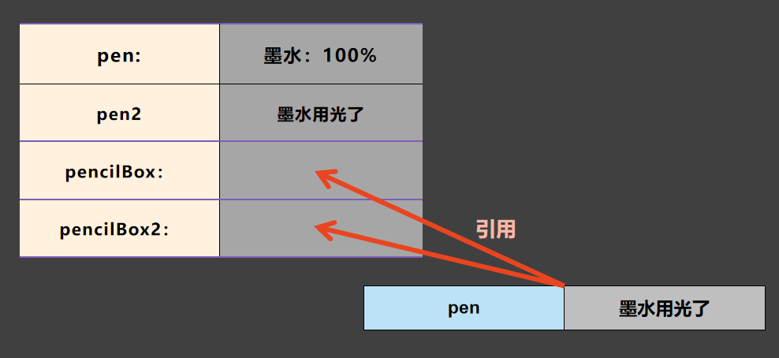

## 概述

引用类型可以存储复杂多元的数据，让数据具有关联性。上一节所说的函数，是一种特殊的引用类型，因为它一般不用来存储数据，是用来存储代码逻辑。

引用类型下，有这几个分支：

- 对象
- 数组
- 函数

## 对象

**对象是一种复合的数据结构，它的内部可以包含任何一种数据类型，包括对象类型本身**，它常常用来存放关系密切的数据。比如一张身份证上的全部数据，一张明星片的全部信息等等。

### 对象字面量

以下是一个对象的字面量：

```js
var book = {
  name: "三国演义",
  page: 1000,
};

console.log(book); // {name: '三国演义', page: 1000}
console.log(book.name); // '三国演义'
console.log(book.page); // 1000
```

上述代码中，对象的字面量使用一堆花括号包裹，对象内部包含了两个属性叫做 `name` 和 `page`，这两个属性对应的值是 `三国演义` 和 `1000`。

我们可以通过属性访问符 '`.`' 去访问者两个属性。

目前你需要记住的是，对象内部可以存储任何数据类型。

创建对象不仅仅可以通过字面量创建，还可以使用 `new` 关键字修饰 `Object` 函数创建：

```js
var foo1 = {};
var foo2 = new Object();
```

上面两行代码都会生成一个空对象。

### 对象属性

对象是由一个个 **属性** 组合而成。查看一下代码：

```js
var book = {
  name: "JavaScript 入门到卸载",
  price: 9999999,
};
```

上述代码中，`name` 是 `price` 都是 `book` 的属性，他们分别初始化为字符串和数字。

在对象字面量中，属性和他们的初识值用分号 `:` 分割，属性之间用逗号 `,` 分割，最后一个属性末尾的 `,` 可以省略。

### 属性访问

访问一个对象的属性有两种方式，通过 **属性访问符访问** 和 **键访问**，键访问使用方括号。

比如：

```js
var foo = {
  bar: "string",
};

console.log(foo.bar);
console.log(foo["bar"]);
```

以上代码都会打印出 `'string'` 字符串，

其中键访问时，我们可以不使用字符串字面量，可以使用一个变量：

```js
var foo = {
  bar: "string",
};
var key = "bar";
console.log(foo[key]);
```

上述代码也会打印出字符串 `'string'`。

### 属性的增删改

JS 对象非常强大的一点就是，对象的属性是可以动态修改的。

例：

**增：**

```js
var foo = {};

foo.a = 1;
foo.b = "text";

console.log(foo, foo.a, foo.b);
```

**改：**

```js
var foo = { a: 1 };
foo.b = 2;

foo.a = "string a";
foo.b = "string b";

console.log(foo);
```

**删：**

```js
var foo = { a: 1 };

delete foo.a;
delete foo.a;
```

使用 `delete` 关键字可以删除对象的属性，重复执行也不会报错。不过这种删除属性的方式并不能优化性能。

### 函数属性

对象属性可以存储一个函数表达式：

```js
var foo = {
  bar: function (x) {
    console.log(x);
  },
};

foo.bar("ohh");
```

函数属性的执行在访问后直接添加圆括号即可。函数属性同普通属性一样，只是存放的数据是函数而已。

## 数组

数组是对象的一种变体，同对象一样，**数组也可以存储任何类型的数据。**

以下是数组的字面量：

```js
var foo = [1, 2, 3, 4, 5];
var bar = [false, undefined, {}, "content", function fn() {}];
```

数组的字面量使用 `[]` 包裹，内部的值使用 `,` 分割。

### 数组的访问

数组内的数据使用下标来访问，数组中的数据是有顺序的，第一个数据的下标是 `0`，第二的数据的下标是 `1`，依次递增，**从 `0` 开始的计数规则是所有程序语言通用的**，初学者需要花一段时间来熟悉。

查看下列代码：

```js
var foo = [900, 10, true];

console.log(foo[0]); // 900
console.log(foo[1]); // 10
console.log(foo[2]); // true
console.log(foo[3]); // undefined
```

如果下标超出了数组的长度，那么得到的值就是 `undefined`。

函数如何访问？

```js
var foo = [
  1,
  function bar() {
    console.log("bar");
  },
];

foo[1]();
```

函数通过下标访问后需要执行直接在后面添加圆括号即可执行。

### 通过下标给数组的增删改

类似于对象的增删改，数组也可以通过下标来修改数组内的数据：

```js
var foo = [1, 2, 3];

delete a[2];
a[0] = "text";
a[10] = 100;
```

不过需要注意的是，实际开发中，很少会通过下标增加或删除数组内的数据，因为这会给数组内的数据带来空项，数组内置了很多修改内部数据的函数，后面我们会详细介绍。

### 数组长度

每个数组都有一个内置的属性 `length` 用来记录数组的长度：

```js
var foo = [1, 2, 3];
console.log(foo.length);
```

如果你真的要通过下标给数组添加数据，你应该这样做：

```js
var foo = [1, 2, 3];

foo[foo.length - 1] = 4;
```

`length` 是每个数组的内置属性，它记录了数组的长度，这个属性的值总是数组的长度。

删除数据是，你可以通过设置数组长度，从而删除末尾的数据：

```js
var foo = [1, 2, 3];

foo.length = 2;
```

## window 介绍

在 JS 中，有一个内置对象 `window`，它是 JS 中的 **全局对象**。JS 中所有内置的对象，都是它的属性。你可以直接通过 `window` 来访问它：

```js
console.log(window);
```

`window` 上内置了所有的功能模块，有处理 HTML 的、有处理网络的、有用来绘图的等等。

除此之外，**所有在全局作用域声明的变量、函数，都会被作为 `window` 对象的属性**：

```js
var foo = 1;
var bar = { name: "bar" };
function baz() {
  return "fn baz";
}

console.log(window.foo, window.bar, window.baz(), window.window);
```

如果一个变量被隐式声明到全局，它同样会成为 `window` 的属性：

```js
function foo() {
  bar = 1;
}
foo();

console.log(window.bar); // 1
```

`window` 是一个 JS 中非常重要的对象，后面的课程我们会对它进行介绍。

## 复杂的数据类型

目前我们已经学习了课程中所有的数据类型，现在我们必须熟悉它们，尝试模拟一个班级期末考试达标情况的数据：

```js
// 某班级期末成绩达标情况
var data = {
  // 班级名称
  name: "三年二班",

  // 学生数据
  students: [
    // name 姓名，birth 出生日期， score 考试分数，pass 是否达标
    { name: "张三", birth: "2001-06-10", score: 89, pass: true },
    { name: "李四", birth: "2002-10-20", score: 47, pass: false },
    { name: "王二", birth: "1999-01-27", score: 78, pass: true },
  ],

  // 总人数
  totals: function () {
    console.log("共", data.students.length, "个人");
  },
};
```

在未来的开发中，你会经常遇到上述或者比上述代码复杂得多的数据类型，他们存在各种嵌套，内置函数，内置属性。

练习：

- 执行 `totals` 函数
- 打印班级名称和总人数
- 修改李四的出生日期为 `2002-9-20`
- 60 分为合格线，修改王二的成绩为 58，并使数据合理
- 班主任名字叫桃紫，请将班主任名称添加到属性 `master` 上
- 班主任应该被纳入班级的总人数

### 多维数组

数组常常被用来存储结构类似的数据，比如上一节例子中，各个学生的数据。

有时数组表示的数据不是一串，而是多行多列的，这时我们可以使用多维数组来表示多行多列的数据，比如一栋楼的门牌号：

```js
var arr = [
  ["1-1", "1-2", "1-3"],
  ["2-1", "2-2", "2-3"],
  ["3-1", "3-2", "3-3"],
];
```

这种数据结构被叫做 **二维数组**，依次类推，还有三维数组，四维数组，它们被统称为 **多维数组**。

### 链式数据

火车高铁地铁等交通工具由一节节的车厢连接而成，在程序中，也有类似的数据，尝试把火车模拟成数据：

```js
var head = { name: "车头" };
var item1 = { name: "第一节车厢" };
var item2 = { name: "第二节车厢" };
var tail = { name: "末尾车厢" };

head.next = item1;
item1.next = item2;
item2.next = tail;

console.log(head.next.next.name); // 第二节车厢
```

链式数据中，各组数据被称为节点，除去节点携带的数据，它们具有相同的数据类型。

### 循环链式

类似于普通的链式数据，循环链式数据的头尾是相接的：

```js
var one = { name: "one" };
var tow = { name: "tow" };
var three = { name: "three" };

one.next = tow;
tow.next = three;
three.next = one;

console.log(one.next.next.next.name); // one
```

在链式数据中，还有种特殊的情况，数据自身链接到自己，比如：

```js
var foo = { name: "foo" };
foo.next = foo;

console.log(foo.next); // foo.next 就是 foo 自己
```

全局对象 `window` 就是自己链接到自己：

```js
console.log(window.window.window); // 还是 window 本身
```

链式数据也可以存在于数组中：

```js
var foo = [];
foo[0] = foo;
console.log(foo[0][0][0]); // 还是 foo 本身
```

### 分支链式

链式数据也不一定只是单独链接一条数据，有的数据可能会链接多条数据。

比如把北上广深四个城市抽象为数据，从交通上说，它们之间是互联的。它们的就像平面中的四个点，两两互相连接。如果把这种关系抽象为数据，可以用下列方式表示：

```js
var bei = { name: "北京" };
var shang = { name: "上海" };
var guang = { name: "广州" };
var shen = { name: "深圳" };

bei.to = [shang, guang, shen];
shang.to = [bei, guang, shen];
guang.to = [bei, shang, shen];
shen.to = [bei, shang, guang];

console.log(bei.to[2].to[1].to[1]); // 广州
```

【作图演示数据结构】

任意城市都有一个 `to` 属性，其中记录了可以通往的城市，四组数据互相关联，形成复杂的链式结构。

### 高级数据结构

计算机课程中有一门课程叫做数据结构，介绍各种高级的数据类型，不过这些数据结构的底层结构，基本上都是数组或链式结构。

没学过《数据结构》这门课程的同学可以抽时间了解以下，良好的数据结构有利于你的程序开发。

## 引用类型和原始数据类型的区别

引用类型的值被称作 **引用值**，原始数据类型的值被称作 **原始值**。其中，原始值的赋值是 **复制**，而引用值的赋值是 **引用（绑定）**。

查看一下代码：

```js
var pen1 = "墨水：100%";
var pen2 = pen1;
pen2 = "墨水：60%";
console.log(pen1);

var pencilBox1 = { pen: "墨水：100%" };
var pencilBox2 = pencilBox1;
pencilBox2.pen = "墨水用光了";
console.log(pencilBox1.pen);
```

`pen2` 的改动，并没有影响到 `pen1`。而 `pencilBox2` 的改动，却修改了 `pencilBox1` 的属性。



如果赋值引用类型，只会在变量与引用类型数据之间做一个绑定关系，我们称这种关系叫作 **引用**。所以变量并没有真的存储了引用类型，只是存储引用类型数据的位置，根据此位置去找寻数据，在计算机中，我们把数据的位置称作 **地址**。

当我们存储一个引用类型的数据时，我们会存储该引用类型的地址，然后通过地址在内存中寻找这个数据。

如果给一个变量赋值新的引用类型，它只会丢掉原来的引用，然后与当前引用类型做新的绑定：

```js
var foo = [1, 2, 3];
var bar = foo;
bar = [4, 5, 6];

console.log(foo, bar);
```

给 `bar` 赋值新的引用类型，只会丢掉对原来数据的引用，不会覆盖。

这就是引用数据类型和原始数据类型最大的不同。另外，函数，数组也是引用类型，他们也符合上述规则。

## 原始数据的引用形式

数字，字符串和布尔类型的数据也有对象形式，使用 `new` 关键字可以创建他们的对象形式（Null 和 Undefined 类型没有）：

```js
var num = new Number(10);
var str = new String("foo");
var bool = new Boolean(false);

console.log(num, str, bool);
```

这些对象扩展了原始数据的能力，它们提供有很多内置函数来处理原始数据。比如 `Number` 对象就内置了一个函数 `toFixed`，它用来保留数字的小数位：

```js
var num = new Number(10);
console.log(num.toFixed(2)); // 保留两位小数
```

在【常用 API】课程中，我会详细介绍各种类型的内置函数。

## 补充

对象的属性名没有固定的标识符，通过键访问可以在属性名中添加任意非法字符，比如：

```js
var foo = {};
foo["@a"] = 1;
```

上面代码中，我们使用了字符串 `"@a"`，来当对象的属性名，不过这种标识符也只可以通过键访问，不能使用属性访问符：

```js
console.log(foo['@a']); // 1
console.log(foo.@a); // 语法错误
```

## 小结

- 引用类型用来储存复杂的数据结构，主要有三种形式，数组，对象和函数

- 对象一般用来存储相互关联的数据

- 数组一般用来存储多个相同类型的数据

- 赋值原始类型是复制，赋值引用类型是引用。

- 数字字符串和布尔类型有对应的对象形式，它们内置很多函数来扩展原始数据的能力了。
