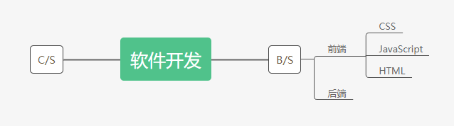

## 概述

课程分为三部分，主要内容为：HTML 基础，CSS 基础，JavaScript 基础三个模块的学习，它们对应网站开发内容、样式和逻辑三部分内容。课程的讲述会按照本讲义的内容进行，讲义放到了两个网站上：

- https://xxwwp.gitee.io/jnet-basic/
- https://xxwwp.github.io/jnet-basic/

上面两个网站都可以访问此讲义。

课程面相零基础的同学，内容深度循序渐进且完整，并不是走马观花，部分知识讲解会比较深入，但是并不会具有跳跃性。课程里理论部分总体要大于实践部分，所以可能会比较枯燥，但是绝对让你觉得干货满满。

## 开发需要安装什么？

初学者需要安装一款 **编辑器** 和一款 **浏览器**。编辑器用来快速编写代码，浏览器用来运行程序。

### 关于编辑器

我比较推荐 [vscode (Visual Studio Code)](https://code.visualstudio.com/) 作为主要开发的编辑器，这款编辑器针对 web 前端开发提供非常好的支持，因为这款编辑器就是使用前端知识开发的。

当然同学们也可以选择 [sublime text](http://www.sublimetext.com/)，这款编辑器轻巧简单，不容易卡顿，不过需要安装一些插件，才能有一个比较好的开发体验。

如果你不想安装本地编辑器，也可以选择在线沙箱 [jsbin](http://jsbin.com/) 或者 [codesandbox](https://codesandbox.io/)。jsbin 方便快捷，可以快速编辑简单的前端代码。codesandbox 功能齐全，不管是入门还是老手，都可以在 codesandbox 找到模板快速编写代码，不过缺点就是国内访问较慢。

编辑器只是用来更好的编写代码，并不是什么复杂的软件，就像系统有自带的记事本编辑器一样，只是上面推荐的编辑器针对开发更加有利。

### 关于浏览器

windows 系统或者 linux 系统的同学，可以使用 [chrome](https://www.google.com/chrome/) 、[火狐浏览器](https://www.mozilla.org/zh-CN/firefox/) 或 [Edge](https://www.microsoft.com/zh-cn/edge) 来开发，不论选择哪一个，都请下载或升级到最新版本。

Mac 系统的同学，可以直接使用 Safari 浏览器开发，也可以自行下载 chrome 或者 Firefox。

_备注: 如果你无法无法访问谷歌浏览器的下载地址。你可以使用其他浏览器代替_

### 课程使用的浏览器和编辑器

课程中使用的浏览器是 chrome，编辑器是 vscode 或者 codesandbox。

### 软件安装

上述介绍的软件可以点击链接去官网下载安装，都是很干净的软件，狂点下一步就行，不会安装其他捆绑软件。

【vs code 中文插件演示】

### codesandbox 登录

课程中，部分代码会被放到 codesandbox 上，比较特殊的是，部分代码需要登录才能编辑。codesandbox 暂时只支持 Google 账号或 GitHub 账号登录。

因为 Google 无法访问，所以同学们需要自己去注册一个 [GitHub](https://github.com/) 账号，然后登录 codesandbox。

【GitHub 简单介绍和注册演示】

_备注: GitHub 是一个的代码仓库网站，用来存储你的代码。_

## 导论

导论会简单介绍网页开发中的一些基本概念，介绍学习的主要内容，对课程有一个初步的认识。简单听听就行，不要求完全理解。

### 开发模式

现在常见的软件开发模式大致被分为两种，分别是 **B/S（浏览器-服务器，Browser/Server）** 开发模式和 **C/S（主从式架构 Client–server）** 开发模式。网页开发就属于 B/S 开发模式。

C/S 开发模式的就是常见的手机 APP，桌面系统客户端等软件开发，比如同微信，QQ 这样的软件，它们会开发出独立的客户端。而 B/S 开发模式就是常见的浏览器网页开发，用户不用安装独立的客户端，通过浏览器打开就可以使用，B/S 又叫 **web 开发**。

### web 开发组成

在技术上，web 被分为 **前端** 和 **后端** ，对应浏览器端和服务器端，本系列的课程会着重于 web 前端开发，后端会有涉及，但是不会深入。

以下 web 前端开发简称为前端。

前端的知识被分成三个部分，**HTML**，**CSS** 和 **JavaScript**

- HTML：负责页面的内容展示
- CSS：负责修改内容的样式
- JavaScript：负责处理页面的逻辑

本系列课程就是主要讲解上面三个知识模块的基础部分，虽然是基础课，并且面相零基础的同学，但是课程并不会讲得很片面，有一定深度。我希望每个同学都能有扎实的基本功，才不会在未来遇到些偏门的问题无处下手。
